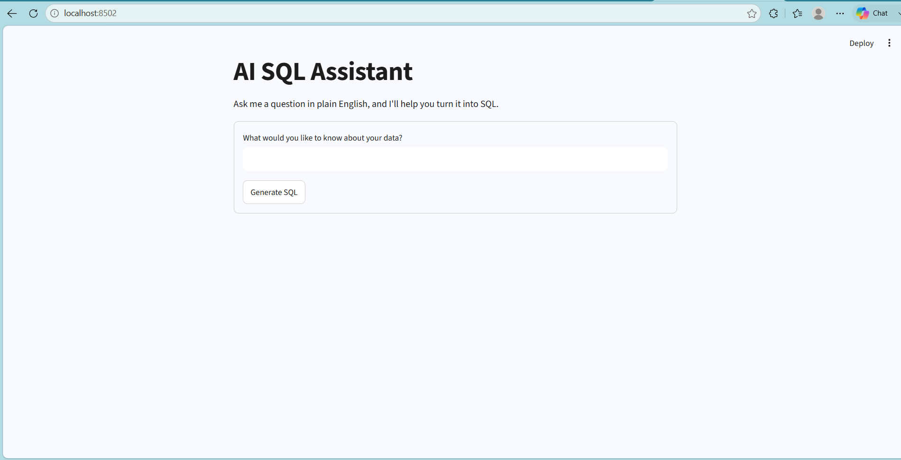
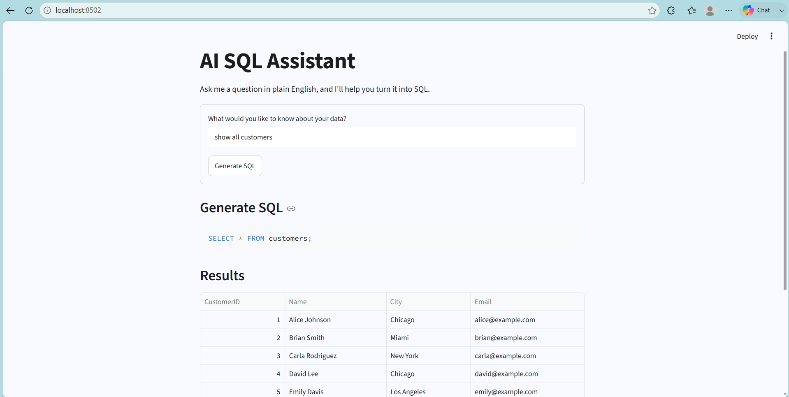
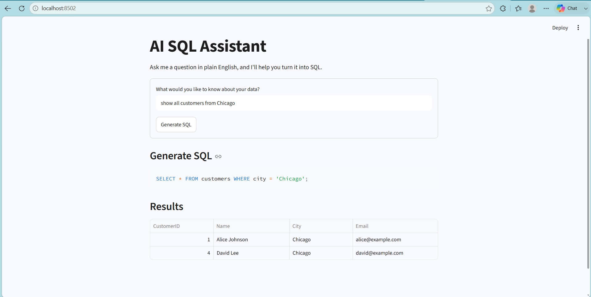
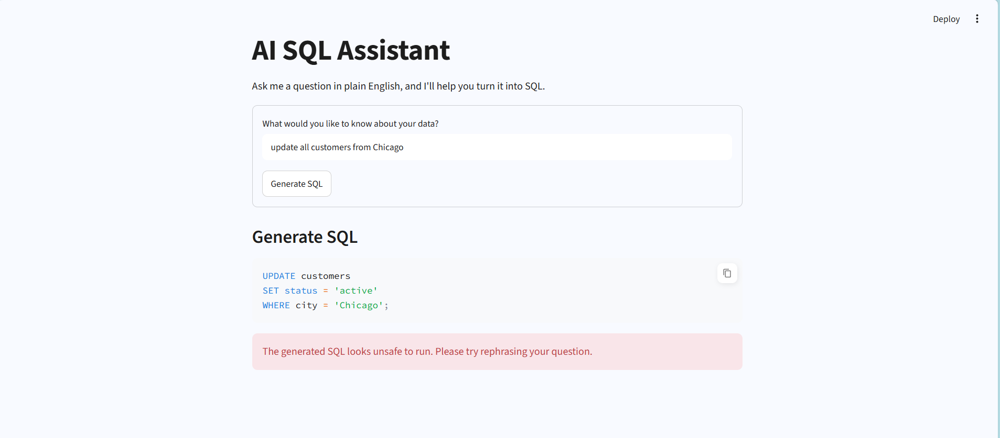

# 🤖 Aesha's AI SQL Assistant

> **Ask questions in plain English. Get SQL. Get insights.**

An AI-powered SQL assistant built with **Python, Streamlit, OpenAI API, and SQLite**. It converts natural language questions into SQL queries, validates them for safety, and retrieves results from a SQLite database.

---

## 🎯 Project Goal

To explore how **Generative AI can make SQL-based data analysis more accessible** while maintaining basic database safety and query validation.

---

## 📸 Project Preview

### 🖥️ Application

*Streamlit interface for asking questions about the database.*

### 🤖 AI-Generated SQL

*The user's natural language question is converted into an SQL query using OpenAI.*

### 📊 Query Results

*The validated SQL query is executed against the SQLite database and the results are displayed.*

### 🔐 Safety & Query Protection

*Unsafe write or destructive SQL operations are rejected instead of being executed.*

---

## ✨ Features

- 💬 **Natural Language → SQL** — Ask questions without writing SQL manually.
- 🤖 **AI-Powered SQL Generation** — Uses OpenAI to generate SQL queries.
- 🗄️ **SQLite Integration** — Executes valid queries against the database.
- 🛡️ **Query Validation** — Checks queries before execution.
- 🔒 **Read-Only Protection** — Blocks `INSERT`, `UPDATE`, `DELETE`, `DROP`, `ALTER`, `TRUNCATE`, and other destructive operations.
- 📊 **Results Display** — Shows query results through Streamlit.

---

## 🧠 How It Works

```text
👤 User Question
       ↓
🤖 OpenAI
       ↓
📝 SQL Generation
       ↓
🛡️ Query Validation
       ↓
🗄️ SQLite
       ↓
📊 Results
```

**Natural Language → AI → SQL → Validation → Database → Results**

---

## 🛠️ Tech Stack

**Python · Streamlit · OpenAI API · SQLite · SQL**

---

## 🔐 Data Safety

The application is designed as a **read-only SQL assistant**. AI-generated queries are validated before execution, and write or destructive operations are rejected to help protect the underlying database.

API keys are stored using environment variables and are not included in the repository.

---

## 🚀 Run Locally

```bash
pip install -r requirements.txt
python -m streamlit run app.py
```

Create a `.env` file:

```text
OPENAI_API_KEY=your_api_key_here
```

> ⚠️ Never commit your `.env` file or API key to GitHub.
